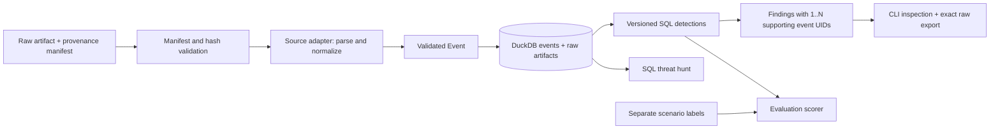

# Architecture

One Python process, one local DuckDB database, SQL files and a CLI. Source
adapters own parsing and normalization; one shared ingestion engine owns
provenance, transactions, conflicts and storage. AWS CloudTrail is the only
implemented parser at this architecture milestone.

## Tables and data flow

`datasets` preserves the submitted provenance manifest and its hash. `artifacts`
stores the original file bytes under SHA-256. `events` stores one normalized row
per event UID within its source identity scheme. `occurrences` links every input-file occurrence
to its dataset, file hash and record pointer. A repeated delivery therefore keeps
its provenance without multiplying normalized events or finding counts.

Ingestion validates mandatory provenance, resolves the provider/source adapter,
checks declared file hashes before parsing, confines paths to the manifest
directory, and uses a transaction. A dataset ID cannot be reused with a changed
manifest. Invalid adapters, source/format mismatches, invalid Events or conflicting
payloads roll back the whole import.

Hashes prove consistency with retained bytes, not independent authenticity of an
arbitrary supplied manifest. Source categorization is an explicit provenance
assertion. This is not a complete forensic chain-of-custody implementation.

## Adapter contract and source registry

An adapter declares its `provider`, `source` and supported artifact `formats`.
`parse` yields exact record pointers and raw objects; `normalize` returns a typed
`Event`; `resolve` retrieves the original record from retained bytes and its
pointer. Normalization receives an immutable context with source, dataset ID and
optional `collection_scope` from the provenance manifest. This allows an explicit
collection boundary when raw records do not carry one; it is never inferred from
a principal's email, name or IP. Declared non-null collection-scope values must
agree with normalized scope. The AWS adapter retains its original raw-field
mapping. Shared validation checks the Event's source, identity scheme, scope,
timestamp, outcome and JSON fields. The normalized raw object must equal the
source object. Evidence resolution uses the same adapter as ingestion.

The registry recognizes these distinct source namespaces:

| Source | Parser status | Scope namespaces |
|---|---|---|
| `aws.cloudtrail` | Implemented | `aws.account` |
| `azure.activity` | Reserved; not implemented | `azure.subscription`, `azure.tenant` |
| `azure.entra.signin` | Reserved; not implemented | `azure.tenant` |
| `azure.entra.audit` | Reserved; not implemented | `azure.tenant` |
| `gcp.audit` | Reserved; not implemented | `gcp.project`, `gcp.organization`, `gcp.folder` |

Reserved adapters fail explicitly before import. Recognition in the registry is
not parser validation or cloud support. Tests inject small, fictional adapters
to check the shared contract; these are not Azure/Entra/GCP implementations.
`eits status` lists registered sources and their implementation status.

## Scope and identity

`scope_type` identifies a provider-specific namespace, and `scope_id` is the
opaque identifier within that namespace. `tenant_id` represents a tenant boundary
where meaningful; it is not an alias for account, subscription, project or
organization. An absent value remains unknown. Generic context queries do not
treat unknown scopes as equivalent.

For the implemented CloudTrail adapter, `scope_type` is `aws.account`, `scope_id`
is `recipientAccountId` falling back to `userIdentity.accountId`, and `tenant_id`
is NULL. `account_id` retains the same AWS value for existing SQL and callers;
it is a compatibility field, not a universal cloud scope. Original provider
values remain in `extensions` and `raw`. Field mappings for reserved adapters
will be defined with their individual parsers; no Azure/GCP mapping runs today.

Source-ID conflict checks use the complete tuple `(provider, source, scope_type,
scope_id, tenant_id, source_event_id)`. Distinct payloads under that tuple are
rejected. NULL scope values compare conservatively within their source for
conflict detection; this does not establish identity equivalence. A source ID
reused in another provider, source, tenant or typed scope cannot conflict solely
because its text matches.

AWS event UIDs retain the published `evt_` plus SHA-256 of canonical raw JSON.
Other source domains use `evt_v2_` plus SHA-256 of the canonical JSON array
`["eits.event.v2", provider, source, scope_type, scope_id, tenant_id, raw]`.
This separates identical
payloads from different source or scope domains without rekeying historical AWS
evidence. Exact JSON canonicalization is defined by `model.canonical`.

Email, username, display name and IP are observations, not cross-cloud identity
keys. No component infers equivalence between accounts, tenants or principals
from those strings.

## Database migration

Schema version **2** adds nullable `scope_type`, `scope_id` and `tenant_id` to
`events`. Opening a version-1 database performs the additive migration in one
transaction, backfilling AWS account scope from the existing `account_id`.
Event UIDs, original columns, raw bytes, occurrence pointers, provenance manifests
and artifact hashes are retained. Unsupported schema versions are rejected;
failed migrations roll back. There is no downgrade migration. The original
Phase 1 executable accepts version 1 only, so reproduction with that executable
uses a fresh database or an original version-1 copy.

## Normalized model and mapping

| Field | CloudTrail mapping / meaning |
|---|---|
| `event_uid` | Historical AWS `evt_` + SHA-256 of canonical original event JSON |
| `source_event_id` | `eventID`; may be absent, and is never assumed globally unique |
| `timestamp` | `eventTime` converted to UTC; missing stays NULL, invalid/naive timestamps reject import |
| `provider`, `source` | `aws`, `aws.cloudtrail` in this phase |
| `account_id` | `recipientAccountId`, falling back to `userIdentity.accountId` |
| `scope_type`, `scope_id`, `tenant_id` | `aws.account`, the same resolved AWS account ID, and NULL |
| `region` | `awsRegion` |
| `actor_id`, `actor_type`, `actor_arn` | `userIdentity.principalId`, `type`, `arn` |
| `credential_id` | `userIdentity.accessKeyId`; an identifier, not the secret access key |
| `source_address`, `source_ip` | Original `sourceIPAddress`, plus a parsed IP if valid; service names stay in the original field |
| `service`, `action` | `eventSource`, `eventName` |
| `outcome`, `error_code` | Top-level/nested `errorCode` or `errorMessage`, or `_return=false`, means failure; otherwise `AwsApiCall` means reported success; other types are unknown |
| `resources` | Original `resources` plus typed references to recorded request group/user/role/trail/policy identifiers |
| `authentication` | Original session context plus tri-state MFA; missing never becomes false |
| `privilege_context` | Recorded session issuer; no invented effective-permission calculation |
| `extensions`, `raw` | CloudTrail-specific fields and complete original event JSON |
| `quality` | Missing timestamp/event ID/account and non-IP source-address observations |

Source references are joined through `occurrences`, not fabricated inside the
original event. JSON record references use RFC 6901 pointers (`/Records/N`, or
empty string for a standalone object); JSONL references use one-based `line:N`.
`event`/`explain` re-hash stored file bytes, locate the record and compare it to
retained raw JSON. `export-raw` writes exactly those original file bytes.

The vocabulary is OCSF-inspired. There is no OCSF conformance claim or dependency.
Rules deliberately use provider-specific fields when a common field would lose
the distinction between key creator, key owner and policy recipient.

## Rule and hunt execution

The data-driven registry declares revisions, query paths, provider/source,
rule/version metadata and evidence contracts. The generic engine contains no
AWS rule-ID or revision special cases. A rule declares either an ordered list
of scalar evidence columns or a list-valued UID column. Both forms support
**1..N distinct supporting events**. Empty, duplicate, nonexistent or mismatched
provider/source evidence is rejected. Source event IDs are read from the store,
not trusted from arbitrary query output.

SQL reads an `events` relation filtered to the provider/source declared by its
registry metadata. The execution wrapper also isolates exclusion subqueries and
hunt joins. There is no ground-truth table, scenario column, fixture-label join,
IP allowlist or model output in the detection path. The engine groups matches by
rule and ordered supporting UIDs; multiple qualifying ingress permissions remain
predicate evidence in a single finding.

Finding IDs incorporate rule ID, version, SQL-file hash and the ordered event
UIDs. The existing two-column declarations preserve Phase 1 finding IDs exactly.
The original SQL files remain byte-identical. New evaluation reports also record
the executed wrapper hash, resolved registry hash and packaged resource hashes;
the original `sql_sha256` field continues to identify the authored SQL file.
Findings are recomputed, not durable case records. To preserve a run, retain its JSON
output, code revision, fixture manifests and database/source files. Changing a
query file changes the finding ID. Each run is batch analysis of supplied files; there
is no streaming watermark or late-arrival service.

The baseline query files remain unchanged. The restart-aware candidate is a
separate SQL file and version. Its observed restart exclusion can remove both
benign and malicious activity, so it is opt-in.

`explain` resolves every supporting UID to retained source evidence. Its context
timeline uses the supporting events' typed scopes and timestamp bounds, rather
than requiring start/end columns or an AWS account. Observed facts, inference
and unresolved facts remain separate; contextual inclusion is not causality.

The current hunt left-joins credential creation to subsequent use over a configurable
window (24 hours by default), preserving unused and unresolvable creations.
Its counts describe observed input, not a learned baseline or a malicious verdict.

## Evaluation compatibility

Ground truth defines a nonempty expected anchor set of any size. Exact set
matching is required for a true positive; an incomplete or wrong set leaves the
scenario missed. Duplicate findings cannot inflate true positives, and ambiguous
scenarios remain unscored. Shared events can support different rules.

The original AWS corpus retains its `anchor_event_ids`/`available_event_ids`
format. Corpora with reused source IDs must use `anchor_event_uids` and
`available_event_uids`, so scope collisions cannot be scored as correct evidence.
Saved Phase 1 reports are immutable. Refactor reports reproduce their findings,
scenario outcomes, metrics, evidence IDs and input/query-file hashes while
truthfully recording new runtime code, schema and execution metadata.

## Locality and failure behavior

Runtime modules use local file I/O and DuckDB, configured with
`enable_external_access=false`. No cloud SDK, credential discovery, geolocation
lookup or network API is used. `scripts/source_official.py` is a separately invoked
public-documentation fetcher; all fetched examples are committed, so normal runs
do not call it. Ground truth is read only by evaluation and demonstration code.

Failed imports roll back. Invalid dates, hash mismatches, unsupported source
formats and conflicting event IDs produce errors. Missing optional identity or
time fields remain NULL and cannot satisfy SQL equality/order predicates. This
conservative behavior creates visible misses rather than guessed correlations.
