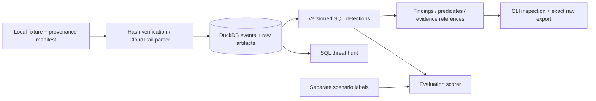

# Architecture — Phase 1

One Python process, one local DuckDB database, SQL files and a CLI. There are no
services, queues, cloud accounts, background collectors or model calls.

## Tables and data flow

`datasets` preserves the submitted provenance manifest and its hash. `artifacts`
stores the original file bytes under SHA-256. `events` stores one normalized row
per distinct canonical raw event. `occurrences` links every input-file occurrence
to its dataset, file hash and record pointer. A repeated delivery therefore keeps
its provenance without multiplying normalized events or finding counts.

Ingestion checks declared hashes before parsing, confines file paths to the
manifest directory, and uses a transaction. A conflicting payload with the same
account/source event ID is rejected rather than silently merged. A dataset ID
cannot be reused with a changed manifest. The schema version is stored in the DB;
there is no automatic migration in Phase 1.

Hashes prove consistency with retained bytes, not independent authenticity of an
arbitrary supplied manifest. Source categorization is an explicit provenance
assertion. This is not a complete forensic chain-of-custody implementation.

## Normalized model and mapping

| Field | CloudTrail mapping / meaning |
|---|---|
| `event_uid` | `evt_` + SHA-256 of canonical original event JSON; stable internal identifier |
| `source_event_id` | `eventID`; may be absent, and is never assumed globally unique |
| `timestamp` | `eventTime` converted to UTC; missing stays NULL, invalid/naive timestamps reject import |
| `provider`, `source` | `aws`, `aws.cloudtrail` in this phase |
| `account_id` | `recipientAccountId`, falling back to `userIdentity.accountId` |
| `region` | `awsRegion` |
| `actor_id`, `actor_type`, `actor_arn` | `userIdentity.principalId`, `type`, `arn` |
| `credential_id` | `userIdentity.accessKeyId`; an identifier, not the secret access key |
| `source_address`, `source_ip` | Original `sourceIPAddress`, plus a parsed IP if valid; service names stay in the original field |
| `service`, `action` | `eventSource`, `eventName` |
| `outcome`, `error_code` | Top-level/nested `errorCode` or `errorMessage`, or `_return=false`, means failure; otherwise `AwsApiCall` means reported success; other types are unknown |
| `resources` | Original `resources` plus typed references to recorded request group/user/role/trail/policy identifiers |
| `authentication` | Original session context plus tri-state MFA; missing never becomes false |
| `privilege_context` | Recorded session issuer; no invented effective-permission calculation |
| `extensions`, `raw` | CloudTrail-specific fields and complete original event JSON |
| `quality` | Missing timestamp/event ID/account and non-IP source-address observations |

Source references are joined through `occurrences`, not fabricated inside the
original event. JSON record references use RFC 6901 pointers (`/Records/N`, or
empty string for a standalone object); JSONL references use one-based `line:N`.
`event`/`explain` re-hash stored file bytes, locate the record and compare it to
retained raw JSON. `export-raw` writes exactly those original file bytes.

The vocabulary is OCSF-inspired. There is no OCSF conformance claim or dependency.
Rules deliberately use provider-specific fields when a common field would lose
the distinction between key creator, key owner and policy recipient.

## Rule and hunt execution

SQL files consume only `events`. There is no ground-truth table, scenario column,
fixture-label join, IP allowlist or model output in the detection path. The engine
groups matches by rule and supporting event pair; multiple matching ingress
permissions become predicate evidence in a single finding.

Finding IDs incorporate rule ID, version, SQL hash and the event pair. Findings
are recomputed, not durable case records. To preserve a run, retain its JSON
output, code revision, fixture manifests and database/source files. Changing a
query changes the finding ID. Each run is batch analysis of supplied files; there
is no streaming watermark or late-arrival service.

The baseline query files remain unchanged. The restart-aware candidate is a
separate SQL file and version. Its observed restart exclusion can remove both
benign and malicious activity, so it is opt-in.

The hunt left-joins credential creation to subsequent use over a configurable
window (24 hours by default), preserving unused and unresolvable creations.
Its counts describe observed input, not a learned baseline or a malicious verdict.

## Locality and failure behavior

Runtime modules use local file I/O and DuckDB, configured with
`enable_external_access=false`. No cloud SDK, credential discovery, geolocation
lookup or network API is used. `scripts/source_official.py` is a separately invoked
public-documentation fetcher; all fetched examples are committed, so normal runs
do not call it. Ground truth is read only by evaluation and demonstration code.

Failed imports roll back. Invalid dates, hash mismatches, unsupported source
formats and conflicting event IDs produce errors. Missing optional identity or
time fields remain NULL and cannot satisfy SQL equality/order predicates. This
conservative behavior creates visible misses rather than guessed correlations.
